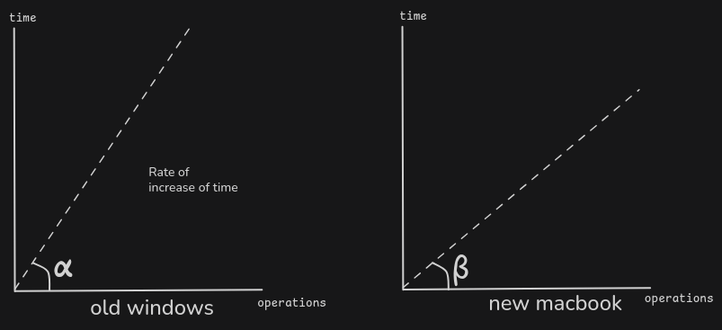
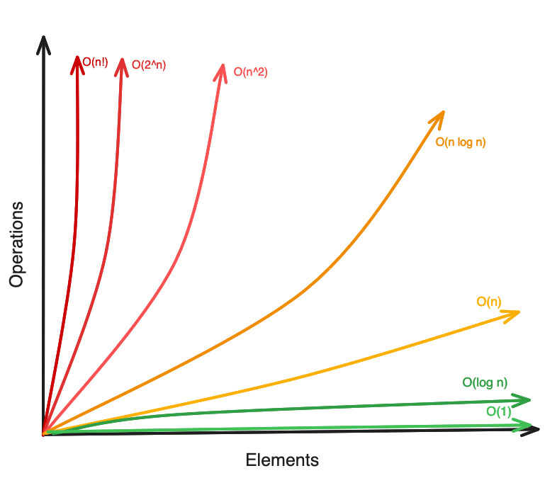

# Time complexity
- Time complexity is a general algebraic sum of operations
- It is rate at which time taken increases with respect to the input size
- old and new machines can have different efficiency, 
- That's why the values are taken in number of operations/time 
- this helps generalize the slope or rate of effectiveness of the program
- it depends on the machine for the hardware capabilities 
- physically the time is different on different machines





### Big Oh
- `O()`
- denotes the hypothetical time taken by the machine 
- it is actually upper bound of algorithm's performance 
- i t is upper bound of how much time/memory was consumed with respect to time
- `O(operations)` operations are counted in asymptotic notation
- There are few rules of counting operations
	1. always in worst case scenarios
		- since the worst covers all the bad that can happen
	2. avoid constants 
		- ex: if there are `N^3`, `N^2` where N is some big number, where `N = 10^5`
		- then the constants in front of that is simply negligible
		- so since it is comparatively tiny we avoid constants 
		- similarly multiplication of constants are avoided since power is too high
	3. avoid lower powers
		- same reason as constants (tiny in comparison) so avoided

ex 1: 
`for(int i = 0; i < n; i++){ /*some operations*/ }`
here n denotes how many times the loop runs, n = 10, 20, 200, 1000
so the time complexity will be `O(n)`

ex 2:
`for(int i = 0; i < 3*n; i++){ /*some operations*/ }`
so the exact time complexity will be `O(3*n)` 
but still the constants will be dropped so it becomes `O(n)` 

ex 3: 
```cpp
if () {}
else if () {}
else if () {}
else {}
```

suppose some minor constant operations in the `{}` in conditions 
so at max there will be 4 operations or so right so it becomes `O(4)`
but for such constants avoid writing the actual number
since who has time to calculate exact ones for slightly longer constants like `O(4539)`
so simply write it `O(1)` and that works 


### Notations for space/time complexity 
- Big O: O, Upper bound
- Theta : θ, Average complexity, average of all the complexities 
- Omega : Ω, Lower bound


### Time complexity computations 

ex 1
```cpp
for (int i = 0; i < n; i++) {
	for (int j = 0; j < n; j++) {
		// some constant operations 
	}
}
```

here for every iteration in the outer loop there is n iteration in inner loop 
for different i values 
`i = 0 -> j = {0 ... n}`, 
`i = 1 -> j = {0 ... n}`, 
`...` ,
`...` ,
`i = n -> j = (0 ... n)` 

=> `n x n` => `n^2`
so the total time complexity would be `O(n^2)`


ex 2 
```cpp
for (int i = 0; i < n; i++) {
	for (int j = 0; j < i; j++) {
		// some constant operations 
	}
}
```

`i = 0`, `j = {0}`
`i = 1`,` j = {0, 1}`
`i = 2`, `j = {0, 1, 2}`
... 
... 
`i = n-1`, `j = {0, 1, 2, ..., n-1}` 
= `1 + 2 + 3 + 4 + .... + n` 
= `N x (N+1)/2`
= `N^2/2` + `N/2`
= `N^2/2` (avoiding the smaller powers) 
≈ `O(N^2)`


##### Graph of various time complexities 



# Space complexity

- Memory space occupied by running of a program 
- Big O notation for the same reason 
- It is rate at which space taken increases with respect to the input size 
- it is comprised of auxiliary space and Input space 
	- auxiliary space is the space to solve the problem 
	- input space is space to store the inputs 

```cpp
int add(int a, int b) {
    int c = a + b;
    return c;
}
```

- `c` is auxiliary space, extra space to compute problem 
- `a`, `b` are the input space 
- so it is `O(3)` => `O(1)`
- auxiliary spaces are crucial to avoid pollution of the input/original data 
- original data should not be polluted


normally for the servers the computations for time and operation ratio goes like this
`1 sec` ≈ `10^8` operations 
`2 sec` ≈ `2 x 10^8` operations 
`3 sec` ≈ `3 x 10^8` operations 
