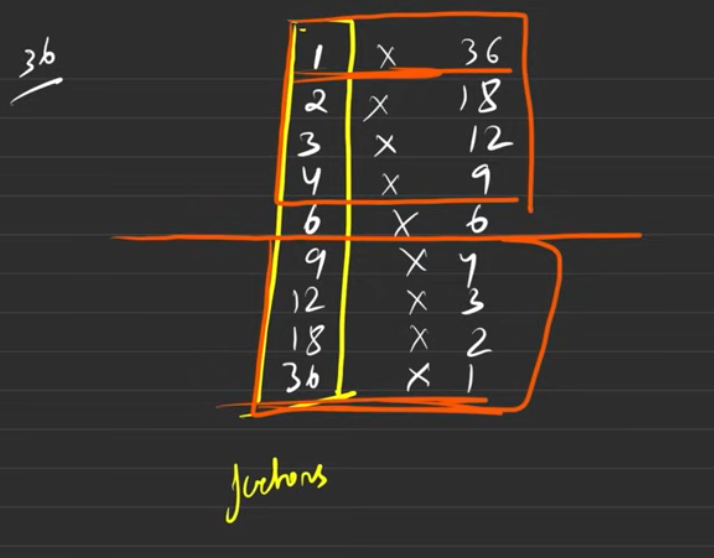
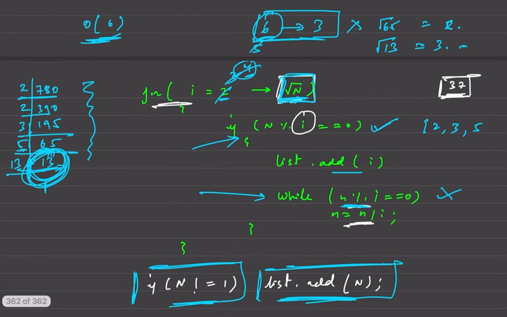
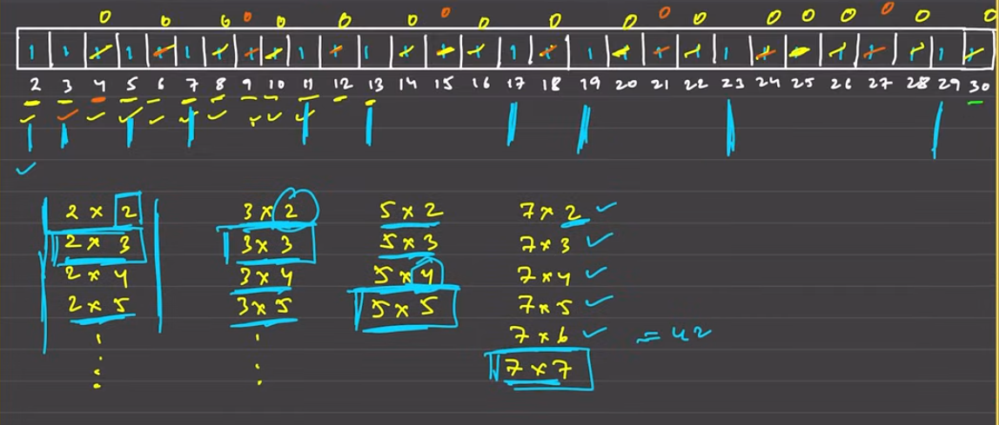

## Basic math concept 

## Digit extraction
- `n = 7789`
- extract digits out of this 
- using `n % 10` we can get the last digit
	- numbers divisible by 10 will give `0`
	- non divisible gives the last digit 
	- so in both the case it is either `rem` or `0`
- so, pseudo code is like `% by 10`, then `/ by 10`
	- `7789 % 10` = `9`, then divide by 10 makes it `778`
	- `778 % 10` = `8`, then divide by 10 makes it `77`
	- `77 % 10` = `7`, then divide by 10 makes it `7`
	- `7 % 10` = `7`,  then divide by 10 makes it `0.xx` so `0`
- number of times is count of digits `O(LogN)`
- time complexity : `O(LogN)`
- since number of iterations is by division so it is Logarithmic 
- since division happens by 10 so `O(Log10N)`

```cpp
// Extraction of digits
void extractDigits(int n)
{
    while (n)
    {
        int rem = n % 10;
        n /= 10;
        cout << rem << endl;
    }
}
```
```txt
Enter n: 57493
3
9
4
7
5
```


---


## Counting number of digits in a number 

```cpp
int countDigits(int n)
{
    int count = 0;
    while (n)
    {
        count++;
        n /= 10;
    }
    return count;
    return (int)(log10(n) + 1); // this is alternate method (using log)
}
```
```txt
Enter n: 57493
5
5
```


---


## Reversing a number 

- get the last number 
- get a `reversed number = 0`
- get to correct place value by `*10` makes it shift by place values 
- then add the remainder from the last number 

```cpp
// without trailing zeros, just placeholder removes them (since +)
int reverse(int n)
{
    int reversed = 0;
    while (n)
    {
        int rem = n % 10;
        reversed = reversed * 10 + rem;
        n /= 10;
    }
    return reversed;
}
```
```txt
Enter n: 456000
654
```


```cpp
// reverse with padding so the trailing zeroes are not ignored 
string reverse_padded(int n)
{
    string reversed = "";
    while (n)
    {
        int rem = n % 10;
        reversed += to_string(rem);
        n /= 10;
    }
    return reversed;
}
```
```txt
Enter n: 456000
000654
```


---


## Check palindrome
- for this check if the reversed and the number itself match or not 
- so first reverse and then check if the numbers match if they do return `true`

```cpp

bool checkPalindrome(int n)
{
    int reversed = 0;
    int temp = n;
    while (temp)
    {
        int rem = temp % 10;
        temp /= 10;
        reversed = reversed * 10 + rem;
    }
    return (reversed == n);
}

int main()
{
    cout << checkPalindrome(123) << endl;
    cout << checkPalindrome(121) << endl;
    cout << checkPalindrome(1245421) << endl;
    cout << checkPalindrome(11) << endl;
    cout << checkPalindrome(10) << endl;
    cout << checkPalindrome(5) << endl;
    return 0;
}
```
```txt
0
1
1
1
0
1
```


---


## Armstrong number 

- An **Armstrong number** (also called a **narcissistic number**, **pluperfect number**, or **pluperfect digital invariant (PPDI)**) is a number that is **equal to the sum of its own digits each raised to the power of the number of digits**.

- A number of `n` digits is an **Armstrong number** if:
	`abcd... = a^n + b^n + c^n + d^n + ...`
Where:
- `a`,`b`,`c`,`d` are the digits of the number
- `n` is the total number of digits

- **9474**
	- It has 4 digits
	- `9^4 + 4^4 + 7^4 + 4^4` = `6561 + 256 + 2401 + 256` = `9474` : ✅ Armstrong  

- **123**
	- it has 3 digits 
    - `1^3 + 2^3 + 3^3` = `1 + 8 + 27` = `36` ❌  Not an Armstrong number.

```cpp
int digitsCount(int n)
{
    int cnt = 0;
    while (n)
    {
        int rem = n % 10;
        n /= 10;
        cnt++;
    }
    return cnt;
}

bool armstrongNumber(int n)
{
    int p = digitsCount(n);
    int total = 0;
    int temp = n;
    while (temp)
    {
        int rem = temp % 10;
        temp /= 10;
        total += pow(rem, p);
    }
    return total == n;
}

int main()
{
    cout << armstrongNumber(153) << endl;
    cout << armstrongNumber(372) << endl;
    cout << armstrongNumber(100) << endl;
    return 0;
}
```
```txt
1
0
0
```


---


## Print factors of a number 
- use a loop go till the number 
- if the number is divisible then print it 
- If you loop from `1` to `n` and check every number:
```cpp
for (int i = 1; i <= n; i++)
	if (n % i == 0)
		cout << i << " ";
cout << endl;
```
```txt
10
1 2 5 10
```


- but it takes `O(N)`
- since the loop goes to the end of the number and prints the divisor 
- but we need to go till square root of n 
- The divisors of a number always come in **pairs** that multiply to `n`.

For example, for `n = 36`:
```txt
1 × 36
2 × 18
3 × 12
4 × 9
6 × 6
```

- Notice that when you reach `i = 6`, both divisors are the same (`6×6`).  
- Beyond `√n`, you’ll just start repeating earlier pairs in reverse order.
- but we get paired divisor (so avoid if duplicated)

We only need to loop **up to √n**:

- If `i` divides `n`, then `i` is a divisor.
- The **other divisor** is `n / i`.
- So for each divisor pair `(i, n/i)` we can print both.
- The loop runs up to √n → **O(√n)** iterations.
- This is a massive speed-up over O(n).




```cpp
int n = 36;
for (int i = 1; i * i <= n; i++)
	if (n % i == 0)
	{
		cout << i << " ";
		if (i != n / i)
			cout << n / i << " ";
	}
cout << endl;
```
```txt
1 36 2 18 3 12 4 9 6 
```


---


## GCD or HCF
- highest number that be divided by two numbers 
- The **GCD / HCF** of two numbers is the **largest number that divides both numbers completely** (i.e. leaves no remainder).

In other words:

> GCD(a, b) = the biggest integer that divides both `a` and `b` evenly.

**GCD(20, 28)**

Factors of 20 → ` 1, 2, 4, 5, 10, 20  `
Factors of 28 → ` 1, 2, 4, 7, 14, 28 ` 
Common → 1, 2, 4  
✅ **GCD = 4**

- there is always a gcd since `1` divides all
- and the max that can give remainder is the minimal number 
	- in `20` and `28`, `20` is the minimum
	- so the number that can give remainder can be till `20`
	- since `20` can divide `20`, but `28` cannot divide `20`
- since we need greatest so make the look go from greatest to smallest 

```cpp
int gcd_brute(int a, int b)
{
    int gcd = 1;
    int n = min(a, b);

    // method 1: 1 -> min(a,b)
    for (int i = 1; i < n; i++)
        if (a % i == 0 and b % i == 0)
            gcd = i;
    return gcd;
}

int gcd_better(int a, int b)
{
	int n = min(a, b);
	// method 2: since want greatest min(a,b) -> 1
    for (int i = n; i >= 1; i--)
        if (a % i == 0 and b % i == 0)
            return i;
    return 1;
}

cout << gcd_brute(20, 28) << endl;
cout << gcd_brute(544, 119) << endl;

cout << gcd_better(20, 28) << endl;
cout << gcd_better(270, 192) << endl;
```
```txt
4
17
4
6
```


The **GCD** of two numbers is the **largest positive integer** that divides both numbers **without leaving a remainder**.
The idea is simple:

> If `a` and `b` are two numbers, then `gcd(a, b) = gcd(b, a % b)`  
> (where `%` is the modulo operator — remainder after division)

We repeat this until `b` becomes 0.  
At that point, **`a` is the GCD**.

Given two numbers `a` and `b`:
1. While `b ≠ 0`
    - Set `temp = b`
    - Set `b = a % b`
    - Set `a = temp`
2. When `b = 0`, **GCD is `a`**
	-  Example: GCD of 48 and 18

| Step | a   | b   | a % b |
| ---- | --- | --- | ----- |
| 1    | 48  | 18  | 12    |
| 2    | 18  | 12  | 6     |
| 3    | 12  | 6   | 0     |
- why the modulo works 
	- essentially we are subtracting a number 
	- subtract it so that no remainder remains 
- `O(log(min(a,b)))`

```cpp
int gcd_euclidian(int a, int b)
{
    while (b)
    {
        int temp = a % b;
        a = b;
        b = temp;
    }
    return a;
}

cout << gcd_euclidian(48, 18) << endl;
cout << gcd_euclidian(56, 98) << endl;
```
```txt
6
14
```


---


## Check the common prime factors of two numbers

- getting the `gcd` factors give the common factors of the numbers
- Let’s say you have two integers: `a` and `b`.
	Let’s denote:
	- `gcd = GCD(a, b)`
	The **GCD** is the **largest number** that divides **both `a` and `b`**.
	Now, if a number `x` divides `gcd`, then:
	- Since `gcd` divides both `a` and `b`, and
	- `x` divides `gcd`,
	- That means `x` also divides both `a` and `b`.
	✅ Therefore, **every factor of `gcd` is a common factor of `a` and `b`**.

Let’s take:
- `a = 12`
- `b = 18`
Then:
- `GCD(12, 18) = 6`
- Factors of 6: `1, 2, 3, 6`

Let’s check these:
- `1` divides 12 and 18 → ✅
- `2` divides 12 and 18 → ✅
- `3` divides 12 and 18 → ✅
- `6` divides 12 and 18 → ✅

So `common factors = {1, 2, 3, 6}` = factors of `GCD(12, 18)` ✅


```cpp
int getGCD(int a, int b)
{
    while (b)
    {
        int temp = b;
        b = a % b;
        a = temp;
    }
    return a;
}

int commonFactors(int a, int b)
{
    int cnt = 0;
    int n = getGCD(a, b);
    for (int i = 1; i * i <= n; i++)
        if (n % i == 0)
        {
            cnt++;
            if (i != n / i)
                cnt++;
        }
    return cnt;
}
```
```
12 6
4
```


---


## Check prime 
- if any number between `2 to n-1` is dividing the number 
- then the number is not prime 

```cpp
bool isPrime(int n)
{
    if (n <= 1)
        return false;
    for (int i = 2; i * i <= n; i++)
        if (n % i == 0)
            return false;
    return true;
}
cout << isPrime(27) << endl;
cout << isPrime(21) << endl;
cout << isPrime(13) << endl;
cout << isPrime(3) << endl;
cout << isPrime(5) << endl;
cout << isPrime(71) << endl;
```
```txt
0
0
1
1
1
1
```


---


## Check prime numbers till n
```cpp
#include <bits/stdc++.h>
using namespace std;

// given a number n print all the primes till that number
// n = 7, so 2,3,5,7
// naively it could be done for (2->n) and check for all the prime

// for brute force check O(n√n), √n for isPrime, n for going till n
// simple check for individual number
bool isPrime(int n) {
  if (n <= 1)
    return false;
  for (int i = 2; i * i <= n; i++)
    if (n % i == 0)
      return false;
  return true;
}

void printAllPrimes(int n) {
  for (int i = 2; i < n; i++)
    if (isPrime(i))
      cout << i << " ";
  cout << endl;
}

int main() {
  printAllPrimes(50);
  return 0;
}
```
```txt
2 3 5 7 11 13 17 19 23 29 31 37 41 43 47
```


---


## Get prime factors 

- same as getting the factors 
- go till the `sqrt(n)`, to get all the factors, 
- but now to get the prime factors reduce/burn the composites made by number 
- burning the multiples removes the composites from getting to `primeFactors` list
- burning sounds fancy right, just cycle in the number till it is not divisible by i, with 0 remainder 
- at end there is some element remaining after division 
- if the remainder is not `1`, add it in factors 




```cpp
vector<int> getPrimeFactors_reduction(int n)
{
    vector<int> primeFactors;
    // 0(√n) for loop * logN for reduction(of multiples), so we donot get composites
    for (int i = 2; i * i <= n; i++)
    {
        if (n % i == 0)
            primeFactors.push_back(i);
        // reduce (burn out all the multiples of current number i)
        while (n % i == 0)
            n = n / i;
    }
    // reached a prime number after all the reduction cannot go any further 
    if (n != 1)
        primeFactors.emplace_back(n);
    sort(primeFactors.begin(), primeFactors.end());
    return primeFactors;
}

ans = getPrimeFactors_reduction(780);
printVector(ans);
```
```txt
2 3 5 13 
```


--- 


## Power Exponentiation 

- get `a^b`, or `pow(a, b)`
- `3^9`
- `ans = 1`
	- `3^9`, odd power so take one power out and makes it even 
	- `3 x 3^8` so `ans = 1 x 3 = 3` (keep the power in evens for breaking it down)
	- `3^8` = `(3^2)^4` = `9^4` = `(9^2)^2` = `(81^2)` = `(81^2)^1` = `6561^1`
	- again odd power `^1` => take one out and reduce the power by 1
	- `6561 x 6561^0` = `6561 x 1` = `6561`


```cpp
// O(log2n) since division by 2
double power(int a, int b)
{
    double ans = 1;
    double base = a;
    int exp = abs(b);

    while (exp > 0)
    {
        if (exp % 2 == 1)
        { // balance the power and make it even
            ans *= base;
            exp--;
        }
        else
        { // make the power reduction by half everytime
            base *= base;
            exp /= 2;
        }
    }
    return b < 0 ? 1.0 / ans : ans;
}

cout << power(2, 13) << endl;
```
```txt
8192
```


---


## Sieve of Eratosthenes
- here we take an `array` or `vector` of `true` to signify the number is prime 
- now starting the loop we make all the multiples of the current `i` as `false`
- make `false` means it is not longer prime then move `i`
- so all the multiples are made zero and only the initials `i` remain
- and we get the vector or `array` of `primes` till that number
- there is not sure-shot time complexity but space complexity is `O(n)`
- for making it `false` we start from `j = i x i`, same logic as primes 
- since the first half have already have the multiples made `false`
- similarly we don't need to got from `2-> n` for making it `false`
	- since `√n` logic, the number will exceed `n` already, why not restrict till `√i`
	- since `√i > n` so the inner loop is from `2-√n`



```cpp
vector<bool> sieve(int n) {
  vector<bool> primes(n + 1, true); // make an array of primes
  primes[0] = primes[1] = false;    // make first two as non-prime

  // since after ixi the number exceeds n already so go till ixi
  for (int i = 2; i * i <= n; i++)
    if (primes[i]) // if only prime(i.e. true) make all the multiples false
	  // start with ixi since the previous multiples already marked false
      for (int j = i * i; j <= n; j += i) // +i jump to make multiples false
        primes[j] = false; // multiples are made false (j is +i multiple)

  return primes; // whatever remained as true are primes
}

void printBooleanVector(vector<bool> a) {
  for (int i = 0; i < a.size(); i++)
    if (a[i])
      cout << i << " ";
  cout << endl;
}

int main() {
  vector<bool> primes = sieve(100);
  printBooleanVector(primes);
  return 0;
}
```
```txt
2 3 5 7 11 13 17 19 23 29 31 37 41 43 47 53 59 61 67 71 73 79 83 89 97
```


--- 

