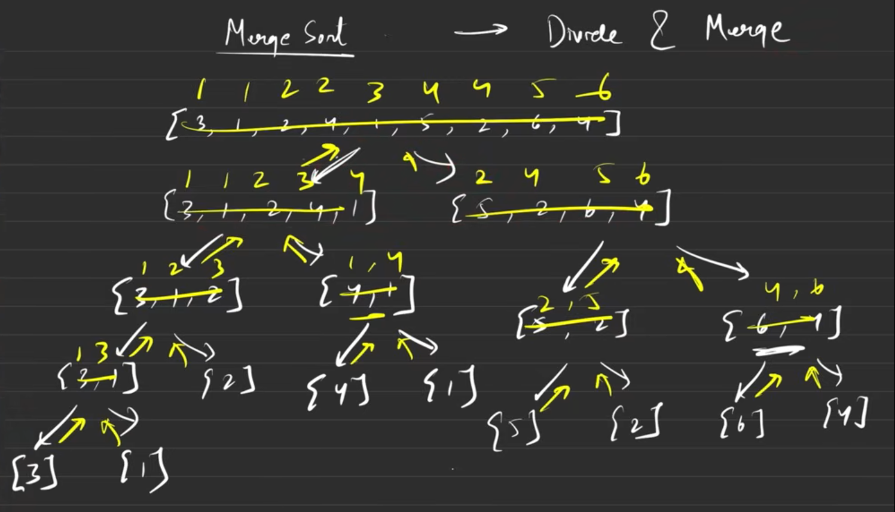
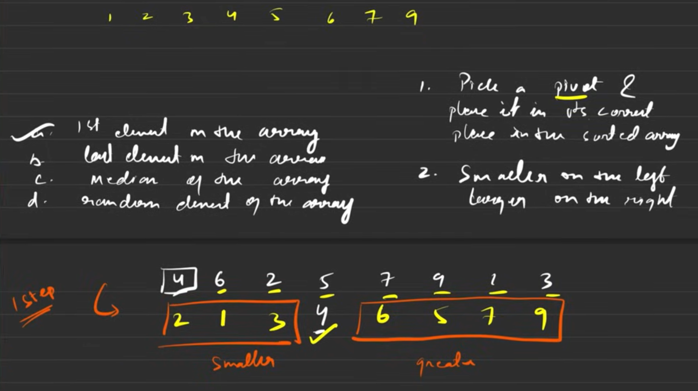
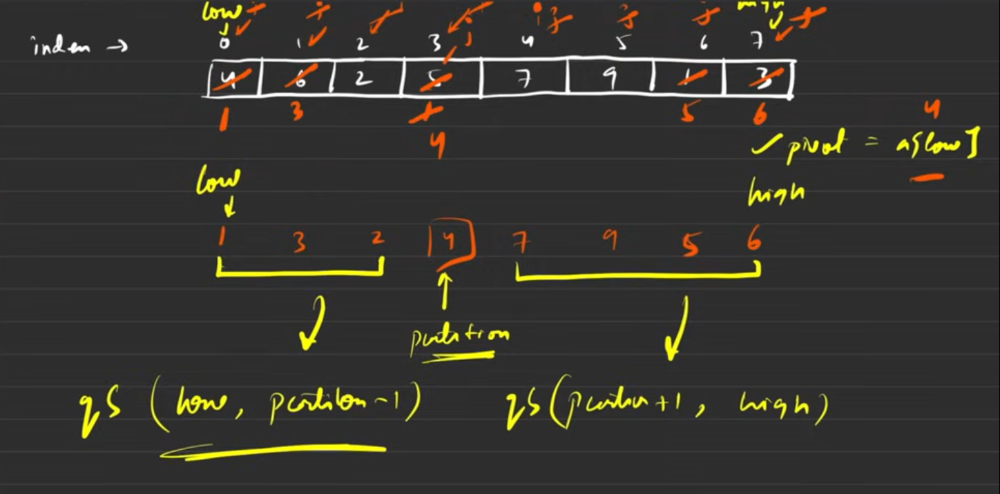

# Selection Sort 

Selection sort repeatedly finds the minimum (or maximum) element from the unsorted portion and swaps it into the next position in the sorted portion.  
- It does exactly `n-1` passes, each time shrinking the unsorted region by one.
- find min/max every iteration and then swap the `minIndex`/`maxIndex` with current pointer `i`
- Time complexity: **O(n²)** (always). Space: **O(1)** (in-place). Not stable (equal elements may change relative order).


### Ascending
- find the `minIndex` and replace `i` with that minimum element

```cpp
void selectionSortAsc(int *arr, int n) {
  for (int i = 0; i < n - 1; i++) {
    int minIndex = i;
    for (int j = i + 1; j < n; j++)
      if (arr[j] < arr[minIndex])
        minIndex = j;
    // swap the element at minIndex and current pointer
    if (minIndex != i) {
      int temp = arr[i];
      arr[i] = arr[minIndex];
      arr[minIndex] = temp;
    }
  }
}
```
```txt
3 5 1 3 -1 5 2 -10
-10 -1 1 2 3 3 5 5
```

```scss
Start:
i=0
[ 3, 5, 1, 3, -1, 5, 2, -10 ]
      ^                 ^     
      (i)               (minIndex found = 7)
swap arr[0] <-> arr[7]:
After swap:
[ -10, 5, 1, 3, -1, 5, 2, 3 ]


i=1
[ -10, 5, 1, 3, -1, 5, 2, 3 ]
       ^            ^        
       (i)         (minIndex found = 4)
swap arr[1] <-> arr[4]:
After swap:
[ -10, -1, 1, 3, 5, 5, 2, 3 ]


i=2
[ -10, -1, 1, 3, 5, 5, 2, 3 ]
         ^ (i)   (minIndex found = 2)
no swap (minIndex == i)
After:
[ -10, -1, 1, 3, 5, 5, 2, 3 ]


i=3
[ -10, -1, 1, 3, 5, 5, 2, 3 ]
            ^        ^       
            (i)   (minIndex found = 6)
swap arr[3] <-> arr[6]:
After swap:
[ -10, -1, 1, 2, 5, 5, 3, 3 ]


i=4
[ -10, -1, 1, 2, 5, 5, 3, 3 ]
               ^      ^      
               (i) (minIndex found = 6)
swap arr[4] <-> arr[6]:
After swap:
[ -10, -1, 1, 2, 3, 5, 5, 3 ]


i=5
[ -10, -1, 1, 2, 3, 5, 5, 3 ]
                  ^    ^     
                  (i) (minIndex found = 7)
swap arr[5] <-> arr[7]:
After swap:
[ -10, -1, 1, 2, 3, 3, 5, 5 ]


i=6
[ -10, -1, 1, 2, 3, 3, 5, 5 ]
                     ^ (i) (minIndex = 6)
no swap
Final (ascending):
[ -10, -1, 1, 2, 3, 3, 5, 5 ]

```


### Descending
- here we take the `maxIndex` and swap with `i` pointer 

```cpp
void selectionSortDes(int *arr, int n) {
  for (int i = 0; i < n - 1; i++) {
    int maxIndex = i;
    for (int j = i + 1; j < n; j++)
      if (arr[maxIndex] < arr[j])
        maxIndex = j;
    // swap maxIndex with the current pointer for desending effect
    if (maxIndex != i) {
      int temp = arr[i];
      arr[i] = arr[maxIndex];
      arr[maxIndex] = temp;
    }
  }
}
```
```txt
3 5 1 3 -1 5 2 -10
5 5 3 3 2 1 -1 -10
```


```scss
Start:
i=0
[ 3, 5, 1, 3, -1, 5, 2, -10 ]
      ^  (maxIndex found = 1)
swap arr[0] <-> arr[1]:
After swap:
[ 5, 3, 1, 3, -1, 5, 2, -10 ]


i=1
[ 5, 3, 1, 3, -1, 5, 2, -10 ]
      ^           ^ (maxIndex found = 5)
swap arr[1] <-> arr[5]:
After swap:
[ 5, 5, 1, 3, -1, 3, 2, -10 ]


i=2
[ 5, 5, 1, 3, -1, 3, 2, -10 ]
         ^    ^ (maxIndex found = 3)
swap arr[2] <-> arr[3]:
After swap:
[ 5, 5, 3, 1, -1, 3, 2, -10 ]


i=3
[ 5, 5, 3, 1, -1, 3, 2, -10 ]
            ^       ^ (maxIndex found = 5)
swap arr[3] <-> arr[5]:
After swap:
[ 5, 5, 3, 3, -1, 1, 2, -10 ]


i=4
[ 5, 5, 3, 3, -1, 1, 2, -10 ]
               ^      ^ (maxIndex found = 6)
swap arr[4] <-> arr[6]:
After swap:
[ 5, 5, 3, 3, 2, 1, -1, -10 ]


i=5
[ 5, 5, 3, 3, 2, 1, -1, -10 ]
                  ^ (i) (maxIndex = 5)
no swap


i=6
[ 5, 5, 3, 3, 2, 1, -1, -10 ]
                     ^ (i) (maxIndex = 6)
no swap
Final (descending):
[ 5, 5, 3, 3, 2, 1, -1, -10 ]

```


--- 


# Bubble Sort 
- the heavier element settle at the bottom and the smaller ones rise as bubbles 
- so we take the `maxElement` and move to the end in every iteration
- `swap` variable is accountable if there is any swap or not 
- in case swap is not done -> array is already sorted no need to go till end 
- for the best if not swapped it becomes `O(N)`, since only one iteration 
- otherwise at max it becomes `O(N^2)`

```cpp
void bubbleSort(int *arr, int n) {
  for (int i = 0; i < n; i++) {
    bool swapped = false;
    for (int j = 0; j < n - 1 - i; j++)
      if (arr[j] > arr[j + 1]) {
        swap(arr[j], arr[j + 1]);
        swapped = true;
      }
    if (!swapped)
      return;
  }
}
```
```txt
3 5 1 3 -1 5 2 -10
-10 -1 1 2 3 3 5 5
```


```scss

												[ 3, 5, 1, 3, -1, 5, 2, -10 ]

i=0
[ 3, 5, 1, 3, -1, 5, 2, -10 ]
    ^  ^ (compare arr[1] & arr[2])
swap arr[1] <-> arr[2]:
After swap:
[ 3, 1, 5, 3, -1, 5, 2, -10 ]


[ 3, 1, 5, 3, -1, 5, 2, -10 ]
        ^  ^ (compare arr[2] & arr[3])
swap arr[2] <-> arr[3]:
After swap:
[ 3, 1, 3, 5, -1, 5, 2, -10 ]


[ 3, 1, 3, 5, -1, 5, 2, -10 ]
            ^  ^ (compare arr[3] & arr[4])
swap arr[3] <-> arr[4]:
After swap:
[ 3, 1, 3, -1, 5, 5, 2, -10 ]


[ 3, 1, 3, -1, 5, 5, 2, -10 ]
                ^  ^ (compare arr[5] & arr[6])
swap arr[5] <-> arr[6]:
After swap:
[ 3, 1, 3, -1, 5, 2, 5, -10 ]


[ 3, 1, 3, -1, 5, 2, 5, -10 ]
                    ^  ^ (compare arr[6] & arr[7])
swap arr[6] <-> arr[7]:
After swap:
[ 3, 1, 3, -1, 5, 2, -10, 5 ]


----------------------------------------------------------------------
												[ 3, 1, 3, -1, 5, 2, -10, 5 ]

i=1
[ 3, 1, 3, -1, 5, 2, -10, 5 ]
^  ^ (compare arr[0] & arr[1])
swap arr[0] <-> arr[1]:
After swap:
[ 1, 3, 3, -1, 5, 2, -10, 5 ]


[ 1, 3, 3, -1, 5, 2, -10, 5 ]
        ^  ^ (compare arr[2] & arr[3])
swap arr[2] <-> arr[3]:
After swap:
[ 1, 3, -1, 3, 5, 2, -10, 5 ]


[ 1, 3, -1, 3, 5, 2, -10, 5 ]
                ^  ^ (compare arr[4] & arr[5])
swap arr[4] <-> arr[5]:
After swap:
[ 1, 3, -1, 3, 2, 5, -10, 5 ]


[ 1, 3, -1, 3, 2, 5, -10, 5 ]
                    ^  ^ (compare arr[5] & arr[6])
swap arr[5] <-> arr[6]:
After swap:
[ 1, 3, -1, 3, 2, -10, 5, 5 ]


----------------------------------------------------------------------
												[ 1, 3, -1, 3, 2, -10, 5, 5 ]

i=2
[ 1, 3, -1, 3, 2, -10, 5, 5 ]
    ^  ^ (compare arr[1] & arr[2])
swap arr[1] <-> arr[2]:
After swap:
[ 1, -1, 3, 3, 2, -10, 5, 5 ]


[ 1, -1, 3, 3, 2, -10, 5, 5 ]
        ^  ^ (compare arr[3] & arr[4])
swap arr[3] <-> arr[4]:
After swap:
[ 1, -1, 3, 2, 3, -10, 5, 5 ]


[ 1, -1, 3, 2, 3, -10, 5, 5 ]
            ^  ^ (compare arr[4] & arr[5])
swap arr[4] <-> arr[5]:
After swap:
[ 1, -1, 3, 2, -10, 3, 5, 5 ]


----------------------------------------------------------------------
												[ 1, -1, 3, 2, -10, 3, 5, 5 ]

i=3
[ 1, -1, 3, 2, -10, 3, 5, 5 ]
^  ^ (compare arr[0] & arr[1])
swap arr[0] <-> arr[1]:
[ -1, 1, 3, 2, -10, 3, 5, 5 ]


[ -1, 1, 3, 2, -10, 3, 5, 5 ]
        ^  ^ (compare arr[2] & arr[3])
swap arr[2] <-> arr[3]:
[ -1, 1, 2, 3, -10, 3, 5, 5 ]


[ -1, 1, 2, 3, -10, 3, 5, 5 ]
            ^  ^ (compare arr[3] & arr[4])
swap arr[3] <-> arr[4]:
[ -1, 1, 2, -10, 3, 3, 5, 5 ]


----------------------------------------------------------------------
												[ -1, 1, 2, -10, 3, 3, 5, 5 ]

i=4
[ -1, 1, 2, -10, 3, 3, 5, 5 ]
    ^  ^ (compare arr[1] & arr[2])
no swap


[ -1, 1, 2, -10, 3, 3, 5, 5 ]
        ^  ^ (compare arr[2] & arr[3])
swap arr[2] <-> arr[3]:
[ -1, 1, -10, 2, 3, 3, 5, 5 ]


----------------------------------------------------------------------
												[ -1, 1, -10, 2, 3, 3, 5, 5 ]

i=5
[ -1, 1, -10, 2, 3, 3, 5, 5 ]
^  ^ (compare arr[0] & arr[1])
no swap


[ -1, 1, -10, 2, 3, 3, 5, 5 ]
    ^  ^ (compare arr[1] & arr[2])
swap arr[1] <-> arr[2]:
[ -1, -10, 1, 2, 3, 3, 5, 5 ]


----------------------------------------------------------------------
												[ -1, -10, 1, 2, 3, 3, 5, 5 ]

i=6
[ -1, -10, 1, 2, 3, 3, 5, 5 ]
^  ^ (compare arr[0] & arr[1])
swap arr[0] <-> arr[1]:
[ -10, -1, 1, 2, 3, 3, 5, 5 ]


----------------------------------------------------------------------
												[ -10, -1, 1, 2, 3, 3, 5, 5 ]

i=7
[ -10, -1, 1, 2, 3, 3, 5, 5 ]
No swaps, algorithm ends

Final (ascending):
[ -10, -1, 1, 2, 3, 3, 5, 5 ]

```


--- 


# Insertion Sort 
- insert the element at the correct position 
##### **Step 1: Outer loop (`i = 1 to n-1`)**
- Insertion sort treats the subarray `arr[0..i-1]` as already sorted.
- So, we start at `i = 1` because a single element (`arr[0]`) is already sorted.
##### **Step 2: Inner loop condition (`j > 0 && arr[j-1] > arr[j]`)**
- `j > 0` ensures we **don’t go past the start of the array**.
- `arr[j-1] > arr[j]` checks if the current element (`arr[j]`) is smaller than the one before it. If yes, we swap.
- so till we get inserted at the correct order we do the swapping and also no out of index

- Best complexity `O(N)`
- Worst complexity `O(N^2)`


```cpp
void insertionSort(int *arr, int n) {
  // starts with 1 since 0 already sorted
  for (int i = 1; i < n; i++) {
    int j = i;
    while (j > 0 && arr[j - 1] > arr[j]) {
      int temp = arr[j];
      arr[j] = arr[j - 1];
      arr[j - 1] = temp;
      j--;
    }
  }
}
```
```txt
3 5 1 3 -1 5 2 -10
-10 -1 1 2 3 3 5 5
```


```scss
Initial array:
[ 3, 5, 1, 3, -1, 5, 2, -10 ]

----------------------------------------------------------------------


i=1
[ 3, 5, 1, 3, -1, 5, 2, -10 ]
Compare arr[0] & arr[1]: 3 <= 5 → no swap

Array remains:
[ 3, 5, 1, 3, -1, 5, 2, -10 ]

----------------------------------------------------------------------


i=2
[ 3, 5, 1, 3, -1, 5, 2, -10 ]
Compare arr[1] & arr[2]: 5 > 1 → swap

[ 3, 1, 5, 3, -1, 5, 2, -10 ]
Compare arr[0] & arr[1]: 3 > 1 → swap
[ 1, 3, 5, 3, -1, 5, 2, -10 ]

----------------------------------------------------------------------


i=3
[ 1, 3, 5, 3, -1, 5, 2, -10 ]
Compare arr[2] & arr[3]: 5 > 3 → swap

[ 1, 3, 3, 5, -1, 5, 2, -10 ]
Compare arr[1] & arr[2]: 3 <= 3 → stop

Array now:
[ 1, 3, 3, 5, -1, 5, 2, -10 ]

----------------------------------------------------------------------


i=4
[ 1, 3, 3, 5, -1, 5, 2, -10 ]
Compare arr[3] & arr[4]: 5 > -1 → swap

[ 1, 3, 3, -1, 5, 5, 2, -10 ]
Compare arr[2] & arr[3]: 3 > -1 → swap

[ 1, 3, -1, 3, 5, 5, 2, -10 ]
Compare arr[1] & arr[2]: 3 > -1 → swap

[ 1, -1, 3, 3, 5, 5, 2, -10 ]
Compare arr[0] & arr[1]: 1 > -1 → swap
[ -1, 1, 3, 3, 5, 5, 2, -10 ]

----------------------------------------------------------------------


i=5
[ -1, 1, 3, 3, 5, 5, 2, -10 ]
Compare arr[4] & arr[5]: 5 <= 5 → no swap

Array remains:
[ -1, 1, 3, 3, 5, 5, 2, -10 ]

----------------------------------------------------------------------


i=6
[ -1, 1, 3, 3, 5, 5, 2, -10 ]
Compare arr[5] & arr[6]: 5 > 2 → swap

[ -1, 1, 3, 3, 5, 2, 5, -10 ]
Compare arr[4] & arr[5]: 5 > 2 → swap

[ -1, 1, 3, 3, 2, 5, 5, -10 ]
Compare arr[3] & arr[4]: 3 > 2 → swap

[ -1, 1, 3, 2, 3, 5, 5, -10 ]
Compare arr[2] & arr[3]: 3 > 2 → swap

[ -1, 1, 2, 3, 3, 5, 5, -10 ]
Compare arr[1] & arr[2]: 1 <= 2 → stop

Array now:
[ -1, 1, 2, 3, 3, 5, 5, -10 ]

----------------------------------------------------------------------


i=7
[ -1, 1, 2, 3, 3, 5, 5, -10 ]
Compare arr[6] & arr[7]: 5 > -10 → swap

[ -1, 1, 2, 3, 3, 5, -10, 5 ]
Compare arr[5] & arr[6]: 5 > -10 → swap

[ -1, 1, 2, 3, 3, -10, 5, 5 ]
Compare arr[4] & arr[5]: 3 > -10 → swap

[ -1, 1, 2, 3, -10, 3, 5, 5 ]
Compare arr[3] & arr[4]: 3 > -10 → swap

[ -1, 1, 2, -10, 3, 3, 5, 5 ]
Compare arr[2] & arr[3]: 2 > -10 → swap

[ -1, 1, -10, 2, 3, 3, 5, 5 ]
Compare arr[1] & arr[2]: 1 > -10 → swap

[ -1, -10, 1, 2, 3, 3, 5, 5 ]
Compare arr[0] & arr[1]: -1 > -10 → swap
[ -10, -1, 1, 2, 3, 3, 5, 5 ]

----------------------------------------------------------------------


Final sorted array (ascending):
[ -10, -1, 1, 2, 3, 3, 5, 5 ]

```


---


# Merge Sort 

- 1. **Divide and Conquer Algorithm**:
    - Merge Sort is based on the **divide and conquer** technique.
    - The array is divided into smaller subarrays, sorted individually, and then merged.
        
2. **Divide Step**:
    - Split the array into two halves:
        - Left half: `arr[low..mid]`
        - Right half: `arr[mid+1..high]`
    - This is done recursively until the subarray has only **one element** (which is trivially sorted).
        
3. **Conquer Step**:
    - Merge the sorted subarrays back into a single sorted array.
    - While merging, compare elements from both subarrays and place the smaller (or larger for descending) in the new array.
        
4. **Base Case**:
    - A subarray of size 1 is already sorted. This is the stopping condition for recursion.
        
5. **Merge Step**:
    - Maintain pointers for both subarrays.
    - Compare elements at the pointers.
    - Pick the smaller one and move the pointer forward.
    - Repeat until all elements are merged.
        
6. **Time Complexity**:
    - Always `O(nlog⁡n)` because:
        - Each division reduces the array size by half (`log⁡ n` divisions)
        - Each merge operation takes linear time `(O(n)`.
            
7. **Space Complexity**:
    - `O(n)` extra space is needed for the temporary array used during merge.
        
8. **Stability**:
    - Merge Sort is **stable**, meaning the relative order of equal elements is preserved.
        
9. **Recursive Nature**:
    - Naturally implemented using recursion, but iterative versions also exist (bottom-up merge sort).
    

```cpp
void merge(int *arr, int low, int mid, int high) {
  int n = high - low + 1; // since low minimal size array
  int temp[n];

  int i = low;     // pointer to left subarray
  int j = mid + 1; // pointer to right subarray
  int k = 0;       // pointer to temp subarray

  while (i <= mid and j <= high)
    if (arr[i] < arr[j])
      temp[k++] = arr[i++];
    else
      temp[k++] = arr[j++];

  // if something is left in i or j sections
  while (i <= mid)
    temp[k++] = arr[i++];
  while (j <= high)
    temp[k++] = arr[j++];

  // i goes from 0 to n-1, iterating over temp[].
  // low + i gives the correct position in arr for each element.
  // since low can start from after i somewhere
  for (int i = 0; i < n; i++)
    arr[low + i] = temp[i];
}

void mergeSort(int *arr, int low, int high) {
  if (low == high)
    return;
  int mid = (low + high) / 2;
  mergeSort(arr, low, mid);
  mergeSort(arr, mid + 1, high);
  merge(arr, low, mid, high);
}
```
```txt
3 5 1 3 -1 5 2 -10
-10 -1 1 2 3 3 5 5
```


```scss
Initial Array:
[ 3, 5, 1, 3, -1, 5, 2, -10 ]

----------------------------------------------------------------------

🔹 Step 1: Split the array
mergeSort(arr, 0, 7)
→ Split into:
  Left  = [ 3, 5, 1, 3 ]   (indices 0–3)
  Right = [ -1, 5, 2, -10 ] (indices 4–7)

----------------------------------------------------------------------

🔹 Step 2: Sort the Left Half [3, 5, 1, 3]
mergeSort(arr, 0, 3)
→ Split into:
  Left  = [ 3, 5 ]  (0–1)
  Right = [ 1, 3 ]  (2–3)

----------------------------------------
▶ Sort Left [3, 5]
mergeSort(arr, 0, 1)
→ Split into [3] & [5]
Both are single elements → return.

Now merge [3] and [5]:
Compare 3 < 5 → take 3
Take remaining 5

Result after merge:
[ 3, 5 ]

----------------------------------------
▶ Sort Right [1, 3]
mergeSort(arr, 2, 3)
→ Split into [1] & [3]
Both are single elements → return.

Now merge [1] and [3]:
Compare 1 < 3 → take 1
Take remaining 3

Result after merge:
[ 1, 3 ]

----------------------------------------
▶ Merge the two sorted halves [3,5] and [1,3]
Left  = [3, 5]
Right = [1, 3]

Comparisons:
1️⃣ Compare 3 vs 1 → 1 < 3 → take 1  
2️⃣ Compare 3 vs 3 → equal → take 3  
3️⃣ Compare 5 vs (empty right) → take 5

Merged result:
[ 1, 3, 3, 5 ]

Array now:
[ 1, 3, 3, 5, -1, 5, 2, -10 ]

----------------------------------------------------------------------

🔹 Step 3: Sort the Right Half [ -1, 5, 2, -10 ]
mergeSort(arr, 4, 7)
→ Split into:
  Left  = [ -1, 5 ]   (4–5)
  Right = [ 2, -10 ]  (6–7)

----------------------------------------
▶ Sort Left [-1, 5]
mergeSort(arr, 4, 5)
→ Split into [-1] & [5]
Both single → return.

Merge [-1] and [5]:
Compare -1 < 5 → take -1
Take remaining 5

Result:
[ -1, 5 ]

----------------------------------------
▶ Sort Right [2, -10]
mergeSort(arr, 6, 7)
→ Split into [2] & [-10]
Both single → return.

Merge [2] and [-10]:
Compare 2 > -10 → take -10
Take remaining 2

Result:
[ -10, 2 ]

----------------------------------------
▶ Merge the two sorted halves [-1,5] and [-10,2]
Left  = [ -1, 5 ]
Right = [ -10, 2 ]

Comparisons:
1️⃣ Compare -1 vs -10 → -10 < -1 → take -10  
2️⃣ Compare -1 vs 2 → -1 < 2 → take -1  
3️⃣ Compare 5 vs 2 → 2 < 5 → take 2  
4️⃣ Take remaining 5

Merged result:
[ -10, -1, 2, 5 ]

Array now:
[ 1, 3, 3, 5, -10, -1, 2, 5 ]

----------------------------------------------------------------------

🔹 Step 4: Final Merge of Left and Right Halves
Left  = [ 1, 3, 3, 5 ]
Right = [ -10, -1, 2, 5 ]

----------------------------------------
▶ Merge Step-by-Step:

Compare 1 vs -10 → take -10  
→ [ -10 ]

Compare 1 vs -1 → take -1  
→ [ -10, -1 ]

Compare 1 vs 2 → take 1  
→ [ -10, -1, 1 ]

Compare 3 vs 2 → take 2  
→ [ -10, -1, 1, 2 ]

Compare 3 vs 5 → take 3  
→ [ -10, -1, 1, 2, 3 ]

Compare next 3 vs 5 → take 3  
→ [ -10, -1, 1, 2, 3, 3 ]

Compare 5 vs 5 → take 5  
→ [ -10, -1, 1, 2, 3, 3, 5 ]

Right side still has one 5 → take 5  
→ [ -10, -1, 1, 2, 3, 3, 5, 5 ]

----------------------------------------------------------------------

✅ Final Sorted Array (Ascending):
[ -10, -1, 1, 2, 3, 3, 5, 5 ]

```

##### Summary of All Merge Operations

| Merge Step | Left Half      | Right Half        | Result                        |
| ---------- | -------------- | ----------------- | ----------------------------- |
| 1          | `[3]`          | `[5]`             | `[3, 5]`                      |
| 2          | `[1]`          | `[3]`             | `[1, 3]`                      |
| 3          | `[3, 5]`       | `[1, 3]`          | `[1, 3, 3, 5]`                |
| 4          | `[-1]`         | `[5]`             | `[-1, 5]`                     |
| 5          | `[2]`          | `[-10]`           | `[-10, 2]`                    |
| 6          | `[-1, 5]`      | `[-10, 2]`        | `[-10, -1, 2, 5]`             |
| 7          | `[1, 3, 3, 5]` | `[-10, -1, 2, 5]` | `[-10, -1, 1, 2, 3, 3, 5, 5]` |


---


# Quick sort 

- better than merge sort since no `temp` array 
- Pseudo code: 
	- Pick a pivot `p` from elements in the array 
		- first element 
		- last element 
		- median element 
		- random element 
	- put the `p` in its correct position 
	- similar to `insertion` sort
	- *insertion* is different.. how to insert at correct place ?
		- in recursion at last there will be one element so it is in its correct position by its own 
	- further element's insertion is done by 
		- smaller on the left
		- larger on the right 1


1. Choose a pivot value (e.g. `pivot = arr[(low+high)/2]` or `arr[low]`).
2. Initialize two pointers: `i = low`, `j = high`.
3. Repeat until `i >= j`:
    - Move `i` forward while `arr[i] < pivot`. Stop when you find `arr[i] >= pivot`.
    - Move `j` backward while `arr[j] > pivot`. Stop when you find `arr[j] <= pivot`.
    - If `i < j`, swap `arr[i]` and `arr[j]`, then `i++`, `j--`.
    - If `i >= j`, partitioning is done; return the index `j` (or `i`) as the split point.
4. After partitioning, all elements left of `j` are ≤ pivot and all elements right of `i` are ≥ pivot (depending slightly on exact loop conditions); recurse on the two subranges.

Short version: pick pivot → use two pointers from both ends to find out-of-place elements → swap them → stop when pointers cross → recurse.


- Space complexity is `O(1)` and 
- time complexity `O(NLogN)` since for all elements `N`, we divide it so `LogN`



```cpp
int partition(int *arr, int low, int high) {
  int i = low - 1, j = high + 1;
  int pivot = arr[low];
  // Hoare's scheme (do while), since moves once at least
  while (true) {
    do i++; while (arr[i] < pivot); // find bigger on i
    do j--; while (arr[j] > pivot); // find smaller on j
    if (i >= j) return j; // returns the splitted index
    swap(arr[i], arr[j]);
  }
}

void quickSort(int *arr, int low, int high) {
  if (low < high) {
    int pivot = partition(arr, low, high);
    quickSort(arr, low, pivot);      // left side
    quickSort(arr, pivot + 1, high); // right side
  }
}
```
```txt
3 5 1 3 -1 5 2 -10
-10 -1 1 2 3 3 5 5
```


```scss
Initial Array:
[ 3, 5, 1, 3, -1, 5, 2, -10 ]

----------------------------------------------------------------------

🔹 Step 1: QuickSort(arr, 0, 7)
Pivot chosen (Hoare's scheme) = arr[low] = 3

Partitioning:
i = -1, j = 8

do i++ until arr[i] >= pivot → i = 0 (arr[0]=3 >= 3)
do j-- until arr[j] <= pivot → j = 7 (arr[7]=-10 <= 3)

i < j → swap arr[0] and arr[7]
[ -10, 5, 1, 3, -1, 5, 2, 3 ]

Next iteration:
i = 1 (arr[1]=5 >= pivot)
j = 6 (arr[6]=2 <= pivot)
i < j → swap arr[1] and arr[6]
[ -10, 2, 1, 3, -1, 5, 5, 3 ]

Next iteration:
i = 2 (arr[2]=1 < pivot) → i++
i = 3 (arr[3]=3 >= pivot)
j = 5 (arr[5]=5 > pivot) → j--
j = 4 (arr[4]=-1 <= pivot)

i < j → swap arr[3] and arr[4]
[ -10, 2, 1, -1, 3, 5, 5, 3 ]

Next iteration:
i = 4 (arr[4]=3 >= pivot)
j = 3 (arr[3]=-1 <= pivot)

i >= j → partition returns j = 3

Array after partition around pivot 3:
[ -10, 2, 1, -1, 3, 5, 5, 3 ]

----------------------------------------------------------------------

🔹 Step 2: Recursively sort left side QuickSort(arr, 0, 3)
Array: [ -10, 2, 1, -1 ]
Pivot = arr[low] = -10

Partitioning:
i = -1, j = 4

i = 0 (arr[0]=-10 >= -10)
j = 3 (arr[3]=-1 <= -10) → false, j--

j = 2 (arr[2]=1 > -10) → j--
j = 1 (arr[1]=2 > -10) → j--
j = 0 (arr[0]=-10 <= -10)

i >= j → partition returns j = 0

Array after partition:
[ -10, 2, 1, -1 ]

Left side QuickSort(arr, 0, 0) → single element → return
Right side QuickSort(arr, 1, 3) → array [2, 1, -1]

----------------------------------------------------------------------

🔹 Step 3: QuickSort(arr, 1, 3)
Array: [ 2, 1, -1 ]
Pivot = arr[low] = 2

Partitioning:
i = 0, j = 4

i = 1 (arr[1]=1 < pivot) → i++
i = 2 (arr[2]=-1 < pivot) → i++
i = 3 (arr[3]=? not checked) arr[3]=? → i = 3

j = 3 (arr[3]=-1 <= pivot) → j = 3

i >= j → partition returns j = 2

Array after partition:
[ -10, -1, 1, 2, 3, 5, 5, 3 ]

Left side QuickSort(arr, 1, 2) → [ -1, 1 ]
Pivot = arr[1]=-1

i = 0, j = 3
i = 1 (arr[1]=-1 >= pivot)
j = 2 (arr[2]=1 > pivot) → j--
j = 1 (arr[1]=-1 <= pivot)

i >= j → partition returns j=1 → array stays [ -10, -1, 1, 2, 3, 5, 5, 3 ]

Right side QuickSort(arr, 3, 3) → single element → return

----------------------------------------------------------------------

🔹 Step 4: Recursively sort right side QuickSort(arr, 4, 7)
Array: [ 3, 5, 5, 3 ]
Pivot = arr[4]=3

Partitioning:
i = 3, j = 8

i = 4 (arr[4]=3 >= pivot)
j = 7 (arr[7]=3 <= pivot)
i < j → swap arr[4] and arr[7]
[ -10, -1, 1, 2, 3, 5, 5, 3 ] → swapping 3 and 3 no change

Next:
i = 5 (arr[5]=5 >= pivot)
j = 6 (arr[6]=5 > pivot) → j--
j = 5 (arr[5]=5 > pivot) → j--
j = 4

i >= j → partition returns j = 4

Left side QuickSort(arr, 4, 4) → single element → return  
Right side QuickSort(arr, 5, 7) → array [5,5,3]

Pivot = arr[5]=5

Partitioning:
i = 4, j = 8

i = 5 (arr[5]=5 >= pivot)
j = 7 (arr[7]=3 <= pivot)
i < j → swap arr[5] and arr[7]
[ -10, -1, 1, 2, 3, 3, 5, 5 ]

Next:
i = 6 (arr[6]=5 >= pivot)
j = 6 → i >= j → partition returns 6

Left QuickSort(arr,5,6) → [3,5]
Pivot = 3

Partitioning:
i=4, j=7
i=5 (arr[5]=3 >=3)
j=6 (arr[6]=5>3) → j--
j=5 (arr[5]=3<=3)
i>=j → partition returns 5

Array now sorted:
[ -10, -1, 1, 2, 3, 3, 5, 5 ]

----------------------------------------------------------------------

✅ Final Sorted Array (Ascending):
[ -10, -1, 1, 2, 3, 3, 5, 5 ]

```


--- 


# Randomized quick sort
- using same hoarse algo so swap low and randomized element index


```cpp
int randomizedPartition(int *arr, int low, int high) {
  // pick random between low -> high (random offset from low (high-low+1))
  int randomIndex = low + rand() % (high - low + 1);
  swap(arr[low], arr[randomIndex]);
  int pivot = arr[low]; // since hoarse algo is designed on low
  int i = low - 1, j = high + 1;

  while (true) {
    do i++; while (arr[i] < pivot); // move till element < pivot
    do j--; while (arr[j] > pivot); // move till element > pivot
    if (i >= j)return j;            // return splitted index
    swap(arr[i], arr[j]); // swap out of place elements
  }
}

void randomizedQuickSort(int *arr, int low, int high) {
  if (low < high) {
    int pivot = randomizedPartition(arr, low, high);
    randomizedQuickSort(arr, low, pivot);      // left side
    randomizedQuickSort(arr, pivot + 1, high); // right side
  }
}
```
```txt
3 5 1 3 -1 5 2 -10
-10 -1 1 2 3 3 5 5
```


--- 


## Recursive bubble sort 
- outer loop is removed and replaced with a base case

```cpp
void bubbleSortRec(int *arr, int n) {
  if (n <= 0)
    return;

  bool swapped = false;
  // since the i loop is taken by recursion itself
  for (int j = 0; j < n - 1; j++)
    if (arr[j] > arr[j + 1]) {
      swap(arr[j], arr[j + 1]);
      swapped = true;
    }
  if (!swapped) // already sorted
    return;
  bubbleSortRec(arr, n - 1);
}
```


--- 


## Recursive insertion sort 

```cpp
void recursiveInsertionSort(int *arr, int i, int n) {
  if (i == n)
    return;

  // removed the upper loop for i = 0 -> n (rec call)
  for (int j = i; j > 0; j--)
    if (arr[j] < arr[j - 1])
      swap(arr[j], arr[j - 1]);
    else
      break;
  recursiveInsertionSort(arr, i + 1, n);
}
```


--- 


## Recursive selection sort 

```cpp
void recursiveSelectionSort(int *arr, int i, int n) {
  if (i == n)
    return;
  int minIndex = i;
  // just removed upper loop and made recursive call
  for (int j = i; j < n; j++)
    if (arr[minIndex] > arr[j])
      minIndex = j;
  swap(arr[minIndex], arr[i]);
  recursiveSelectionSort(arr, i + 1, n);
}
```


---


## Quick sort descending 
- just reverse the while condition in the do while loop 
- so till the left side is bigger iterate further 
- similarly if the right side element is smaller iterate further 

```cpp
int partition(int *arr, int low, int high) {
  int pivot = arr[low];
  int i = low - 1, j = high + 1;
  while (true) {
    do
      i++;
    while (arr[i] > pivot);
    do
      j--;
    while (arr[j] < pivot);
    if (i >= j)
      return j;
    swap(arr[i], arr[j]);
  }
}

void quickSortDec(int *arr, int low, int high) {
  if (low < high) {
    int pivot = partition(arr, low, high);
    quickSortDec(arr, low, pivot);
    quickSortDec(arr, pivot + 1, high);
  }
}
```


---
